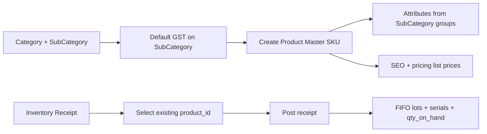
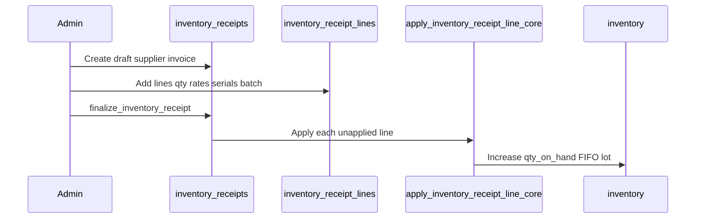

# Shop ERP — Inventory, Accounting & Commerce

## Design principles

| Layer | Responsibility |
|-------|----------------|
| **Product master** (`products`) | One row per SKU. Name, barcode, brand, category, HSN, GST override, warranty, attributes, SEO, pricing list prices. Never duplicated on stock-in. |
| **Inventory summary** (`inventory`) | `qty_on_hand`, `avg_cost` — updated only by receipt lines / FIFO consumption (backward compatible with storefront). |
| **Inventory transactions** | `inventory_receipts` + `inventory_receipt_lines` + serials → `stock_lots` (FIFO) + `inventory_movements` ledger. |
| **Calculator quotations** (`quotations`) | Unchanged — calculator engine only. |
| **Shop quotations** (`shop_quotations`) | B2B quotes tied to `customers`. |

## Product workflow

1. Admin defines **category** / **subcategory** (default HSN, default GST %, SEO).
2. Admin creates **product** with unique SKU (trigger seeds `product_attributes` + empty `inventory` row).
3. Stock is **not** set on product save (except legacy); use **Purchase → Inventory receipt**.
4. Receipt line references `product_id` — same SKU receives more stock, no new product row.

## Purchase / inventory workflow

**Entry fields** (per line): supplier (header), purchase invoice no, purchase date, product, quantity, purchase rate, GST, MRP, selling/dealer/distributor prices, batch, serials, remarks.

**Statuses**: `draft` → `posted` via `finalize_inventory_receipt(uuid)`.

## FIFO / serial / batch / warranty

| Feature | Implementation |
|---------|----------------|
| FIFO | `stock_lots` ordered by `received_at`; `consume_stock_fifo(product_id, qty)` for sales |
| Batch | `batch_number` on receipt line → copied to `stock_lots` |
| Serial | `inventory_receipt_serials` → `product_serials` (global unique serial) |
| Warranty | `products.warranty_months` → `product_serials.warranty_expires_at` from purchase date |

## GST

- **Default HSN**: `sub_categories.default_hsn_code` — copied to product on create / sub-category change.
- **Default**: `sub_categories.default_gst_percentage` (default 18%).
- **Override**: `products.use_gst_override = true` uses `products.tax_percentage`.
- **Resolution**: SQL `resolve_product_gst_percentage(product_id)`; applied on receipt lines.

## Pricing (master vs transaction)

| Field | Product master | Receipt line (optional sync) |
|-------|----------------|------------------------------|
| Purchase / cost | `cost_price` | `purchase_rate` updates cost on post |
| MRP | `mrp` | line `mrp` |
| Online (customer) | `online_price` (+ sync `base_price` / `selling_price`) | line `online_price` |
| Dealer / technician | `dealer_price` | line `dealer_price` |

## Accounting

On posted purchase, `post_inventory_receipt_journal`:

- Debit **Inventory** (subtotal)
- Debit **GST Input** (tax)
- Credit **Accounts Payable** (total)

Chart: `ledger_accounts` (seeded). Extensible via `journal_entries` / `journal_lines`.

## Shop quotations workflow

1. Create/select `customers`.
2. `shop_quotations` + `shop_quotation_lines` (product-linked or free-text label).
3. Status: draft → sent → accepted / rejected / converted.

## SEO workflow (simplified)

**Admin edits only:** SEO title, meta description, slug (optional manual override; auto from name).

**System auto-generates on save:** canonical URL, Open Graph title (= SEO title), OG description (= meta description), OG image (category/subcategory image URL or product main image; product optional OG override).

**URLs:** `/shop/{category-slug}`, `/shop/{category}/{subcategory}`, `/product/{slug}`

**JSON-LD:** stored in `products.metadata.schema_json_ld` (Product schema); CollectionPage helpers in `ShopStructuredData`.

**Deprecated columns (kept for compat, not in admin UI):** `meta_keywords`, manual OG fields on legacy rows migrated on `20260604150000_shop_seo_simplify.sql`.

Flutter: `ShopSeoService`, `ShopSeoAdminInput`, `ShopSeoConfig.baseUrl`.

## Reports (SQL views)

| View | Purpose |
|------|---------|
| `v_inventory_stock_report` | On-hand, value, FIFO lots, serials |
| `v_purchase_register` | Posted purchases by line |
| `v_gst_summary` | Monthly input GST |

## Compatibility

- Firebase Auth + Connect/Firestore unchanged.
- `products.online_price` drives customer price; trigger syncs `base_price` and `selling_price` for legacy clients.
- Calculator uses same `products` / `product_attributes`.
- Existing `inventory` row per product retained; qty driven by receipts.

## Flutter admin map

| Module | Path |
|--------|------|
| Repositories | `lib/features/shop/data/shop_erp_repository.dart` |
| Validation | `lib/features/shop/admin/validation/shop_erp_validation.dart` |
| Screens | `lib/features/shop/admin/erp/` |
| Routes | `RouteNames.adminShopPurchases`, etc. |
